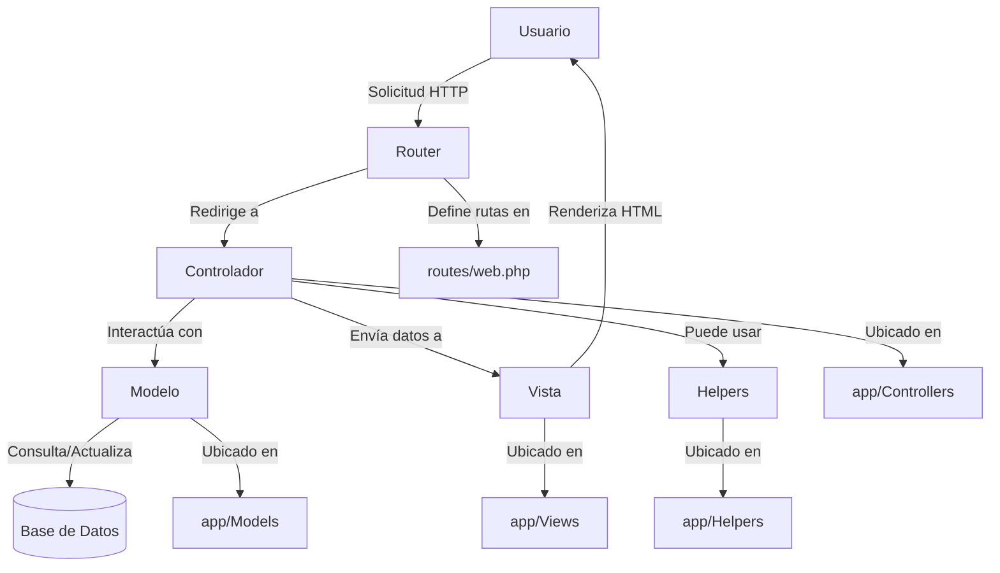

# Informe Final de Trabajo de Graduación

h. Introducción

La presente introducción ofrece una visión general del proyecto desarrollado para la Alcaldía de Santiago, enfocado en la gestión digital de denuncias y quejas ciudadanas.

**Planteamiento del problema:**
Actualmente, la gestión de denuncias y quejas en la Alcaldía de Santiago se realiza de manera tradicional, lo que genera demoras, largas filas, pérdida de información y falta de transparencia. Los procesos manuales dificultan el seguimiento de casos y la atención eficiente a los ciudadanos, evidenciando la necesidad de modernizar y digitalizar estos trámites para mejorar la calidad del servicio público.

**Objetivos:**
- Objetivo general: Desarrollar una plataforma web que centralice la gestión de trámites, denuncias y quejas, optimizando los procesos administrativos y mejorando la experiencia de usuario mediante una arquitectura MVC y prácticas ágiles XP.
- Objetivos específicos:
	1. Implementar módulos para la gestión de denuncias, quejas y postulaciones, permitiendo operaciones CRUD completas.
	2. Integrar un sistema de autenticación y autorización por roles (usuario, administrador).
	3. Construir una interfaz responsiva y accesible, con notificaciones y validaciones visuales.
	4. Utilizar una base de datos relacional para almacenar y consultar información de manera segura.
	5. Garantizar la seguridad de los datos y la protección de archivos sensibles.

**Metodología:**
El desarrollo se basó en la metodología ágil Extreme Programming (XP), priorizando la simplicidad, la comunicación constante y la retroalimentación rápida. Se emplearon herramientas como Visual Studio Code, Git, Composer, XAMPP y MySQL para facilitar la colaboración, el control de versiones y la integración continua.

**Estructura del documento:**
El informe está organizado en capítulos que abordan:
- Fundamentación del proyecto: Justificación, problemática y objetivos.
- Marco teórico: Conceptos clave y tecnologías utilizadas.
- Metodología: Proceso de desarrollo y herramientas.
- Diseño y desarrollo: Arquitectura, interfaz y backend.
- Pruebas y validación: Tipos de pruebas y resultados esperados.
- Conclusiones: Cambios recientes, recomendaciones y perspectivas futuras.

> **Nota:** Este documento ha sido generado automáticamente por GitHub Copilot, analizando el código fuente y la estructura actual del proyecto en el workspace. El contenido está organizado y redactado para cumplir con los requisitos de un informe académico extenso y detallado, siguiendo la estructura proporcionada.

## Autoload y configuración con bootstrap.php

El archivo `config/bootstrap.php` implementa el sistema de autoload para las clases del proyecto. Utiliza la función `spl_autoload_register` para cargar automáticamente cualquier clase bajo el namespace `App\` desde la carpeta `app/`, siguiendo la estructura de subcarpetas (por ejemplo, `App\Controllers\MiControlador` se carga desde `app/Controllers/MiControlador.php`).

**Ventajas del autoload:**
- Elimina la necesidad de usar `require` o `include` manualmente en cada archivo.
- Facilita la organización y escalabilidad del código bajo el patrón MVC.
- Permite que los controladores, modelos y helpers se carguen automáticamente cuando se instancian.

**Ejemplo de uso:**
Si se instancia la clase `App\Models\Conexion`, el autoload buscará y cargará automáticamente el archivo `app/Models/Conexion.php`.

Este sistema asegura que el proyecto mantenga una estructura limpia y desacoplada, facilitando el mantenimiento y la extensión futura.
## Capítulo 1: Fundamentación del Proyecto

### 1.1 Problemática y Justificación

El presente proyecto surge como respuesta a la necesidad de modernizar y optimizar la gestión municipal, facilitando la interacción entre la administración local y los ciudadanos. El código fuente revela una plataforma web integral que centraliza trámites, quejas, postulaciones y comunicación institucional, permitiendo a los usuarios acceder a servicios y realizar gestiones sin desplazamientos físicos.

La problemática principal abordada es la ineficiencia y lentitud de los procesos administrativos tradicionales, que generan largas filas, demoras y falta de transparencia. El software resuelve esto digitalizando los trámites, automatizando la recepción y seguimiento de solicitudes, y ofreciendo canales directos de comunicación. La relevancia radica en la mejora de la calidad de vida de los ciudadanos, la reducción de la carga administrativa y el fortalecimiento de la transparencia institucional.

La justificación técnica se fundamenta en la adopción de una arquitectura MVC y la metodología XP, que garantizan escalabilidad, mantenibilidad y entregas rápidas. El uso de controladores, modelos y vistas bien definidos, junto con rutas centralizadas y validaciones de seguridad, permite una solución robusta y adaptable a futuras necesidades municipales.

### 1.3 Diagrama de Arquitectura del Proyecto

Este diagrama representa el flujo principal de la plataforma:

#### Explicación detallada del diagrama MVC

1. **Usuario:** Interactúa con la plataforma a través de un navegador web, enviando solicitudes HTTP (por ejemplo, acceder a una página, enviar un formulario de queja, postulación, etc.).

2. **Router:** Recibe la solicitud del usuario y determina qué controlador debe gestionarla. El router está definido en el archivo `routes/web.php`, donde se especifican las rutas y los métodos de los controladores asociados a cada URL.

3. **Controlador:** Es el núcleo de la lógica de negocio. El controlador recibe la solicitud, valida los datos, decide qué acciones tomar y puede interactuar con los modelos para acceder o modificar información en la base de datos. Los controladores están ubicados en `app/Controllers/` y cada uno gestiona una funcionalidad específica (por ejemplo, quejas, postulaciones, administración).

4. **Modelo:** Encapsula la lógica de acceso y manipulación de datos. El modelo se comunica con la base de datos (MySQL) usando PDO, ejecutando consultas y devolviendo resultados al controlador. Los modelos están en `app/Models/` y representan entidades como usuarios, quejas, postulaciones, etc.

5. **Base de Datos:** Almacena toda la información relevante del sistema: usuarios, trámites, quejas, archivos subidos, etc. El modelo realiza operaciones CRUD (crear, leer, actualizar, eliminar) sobre la base de datos.

6. **Vista:** Recibe los datos procesados por el controlador y genera la interfaz HTML que se muestra al usuario. Las vistas están en `app/Views/` y pueden incluir componentes visuales, formularios y tablas dinámicas.

7. **Helpers:** Son utilidades o funciones auxiliares que pueden ser usadas por los controladores para tareas específicas, como validaciones, formateo de datos, envío de correos, etc. Se encuentran en `app/Helpers/`.

8. **Flujo completo:**
	- El usuario realiza una acción en la interfaz.
	- El router interpreta la URL y llama al controlador adecuado.
	- El controlador valida y procesa la solicitud, usando modelos y helpers si es necesario.
	- El modelo interactúa con la base de datos y devuelve los datos al controlador.
	- El controlador pasa los datos a la vista.
	- La vista genera el HTML y lo envía al navegador del usuario.

Este flujo asegura una separación clara de responsabilidades, facilitando el mantenimiento, la escalabilidad y la seguridad del sistema.

### 1.2 Objetivos

#### 1.2.1 Objetivo General

Desarrollar una plataforma web municipal que centralice la gestión de trámites, quejas, postulaciones y comunicación ciudadana, optimizando los procesos administrativos y mejorando la experiencia de usuario mediante una arquitectura MVC y prácticas ágiles XP.

#### 1.2.2 Objetivos Específicos

1. Desarrollar módulos de gestión para quejas, denuncias y postulaciones, permitiendo operaciones CRUD completas sobre los registros ciudadanos.
2. Implementar un sistema de autenticación y autorización basado en roles (usuario, administrador), garantizando el acceso seguro a información y funcionalidades sensibles.
3. Construir una interfaz de usuario responsiva, intuitiva y accesible, utilizando HTML, CSS y JavaScript, con integración de librerías como Alertify.js para notificaciones.
4. Integrar una base de datos relacional (MySQL) para almacenar y consultar información de usuarios, trámites, quejas y archivos subidos, utilizando modelos y consultas seguras (PDO).
5. Garantizar la seguridad de los datos mediante validaciones en formularios, control de sesiones, protección de archivos sensibles y gestión de intentos de login.

---

## Capítulo 2: Marco Teórico

### 2.1 Conceptos Fundamentales

**Arquitectura MVC:**
El proyecto implementa el patrón Modelo-Vista-Controlador (MVC), separando claramente la lógica de negocio, la presentación y el acceso a datos. La carpeta `app/Controllers/` contiene los controladores, responsables de recibir las solicitudes del usuario, procesar la lógica y decidir qué vista mostrar. Las vistas se encuentran en `app/Views/`, generando la interfaz HTML y recibiendo datos desde los controladores. Los modelos, ubicados en `app/Models/`, gestionan el acceso a la base de datos y encapsulan la lógica de negocio relacionada con los datos. El archivo `routes/web.php` centraliza la definición de rutas, conectando URLs con controladores y métodos específicos.

**Programación Orientada a Objetos (POO):**
El código utiliza clases para controladores, modelos y utilidades. Por ejemplo, cada controlador es una clase con métodos públicos que representan acciones (como `index`, `process`, `delete`). El modelo `Conexion` encapsula la lógica de conexión a la base de datos, aplicando principios de encapsulamiento y reutilización. La herencia y el polimorfismo pueden extenderse en controladores base o helpers, permitiendo la expansión del sistema sin duplicar código.

**Gestión de Base de Datos:**
El sistema utiliza una base de datos relacional MySQL, como se infiere de la configuración en `config/database.php` y el uso de PDO en los modelos. Las entidades principales incluyen usuarios, postulaciones, quejas, departamentos y subdepartamentos. Las relaciones se gestionan mediante claves foráneas (por ejemplo, cada postulación está asociada a un departamento y subdepartamento). El acceso a datos se realiza mediante consultas preparadas, garantizando seguridad y eficiencia.

### 2.2 Tecnologías Utilizadas

- **PHP:** Lenguaje principal del backend, utilizado para controladores, modelos y vistas.
- **MySQL:** Sistema de gestión de base de datos relacional, almacena usuarios, trámites, archivos y registros.
- **HTML, CSS, JavaScript:** Tecnologías del frontend para la construcción de la interfaz de usuario, estilos y lógica de interacción.
- **Alertify.js:** Librería JS para notificaciones visuales en la interfaz.
- **PHPMailer:** Librería para el envío seguro de correos electrónicos desde el sistema.
- **PDO:** Abstracción de acceso a base de datos en PHP, utilizada en los modelos para consultas seguras.
- **Composer:** Gestor de dependencias PHP, como se observa en `composer.json`.

Cada tecnología fue elegida por su robustez, compatibilidad y facilidad de integración. PHP y MySQL son estándares en aplicaciones web, Alertify.js mejora la experiencia de usuario, y PHPMailer garantiza la fiabilidad en las comunicaciones institucionales. Composer facilita la gestión de librerías y dependencias, asegurando mantenibilidad y escalabilidad.

---

## Capítulo 3: Metodología del Proyecto

### 3.1 Metodología de Desarrollo: Extreme Programming (XP)

El desarrollo del proyecto se basó en la metodología ágil Extreme Programming (XP), priorizando la simplicidad, la comunicación constante, la retroalimentación rápida y el coraje para adaptar cambios. El código y la estructura reflejan estos valores:

- **Simplicidad:** El sistema utiliza una arquitectura MVC clara, con controladores, modelos y vistas bien definidos. Las rutas y la lógica están centralizadas, evitando duplicidad y facilitando el mantenimiento.
- **Comunicación:** El uso de includes estandarizados para header y footer, y la documentación en el README, aseguran que cualquier desarrollador pueda comprender y extender el sistema fácilmente.
- **Retroalimentación:** El sistema está preparado para entregas pequeñas y frecuentes, permitiendo validar funcionalidades con usuarios reales y ajustar el desarrollo según sus necesidades.
- **Coraje:** El proyecto ha migrado de una estructura legacy a una moderna, refactorizando módulos y adaptando la lógica para mejorar la seguridad y escalabilidad.

Las prácticas de XP implementadas incluyen:
- **Diseño simple:** Cada módulo cumple una función específica y se integra mediante rutas claras.
- **Refactorización:** Se migraron y adaptaron vistas, controladores y modelos para mejorar la mantenibilidad.
- **Pruebas:** Aunque no se observa una carpeta de pruebas automatizadas, el sistema está preparado para pruebas unitarias e integración, y se recomienda su implementación futura.
- **Integración continua:** El uso de Git y la modularidad del código facilitan la integración y despliegue frecuente.
- **Entregas pequeñas:** El desarrollo se realizó por módulos, permitiendo validar y ajustar cada funcionalidad antes de avanzar.

### 3.2 Herramientas de Software y Hardware

- **Visual Studio Code:** Editor principal para el desarrollo, con soporte para PHP, HTML, CSS y JS.
- **Git:** Control de versiones y colaboración.
- **Composer:** Gestión de dependencias PHP.
- **XAMPP:** Entorno local para servidor Apache y MySQL.
- **MySQL:** Base de datos relacional.
- **Navegador web moderno:** Para pruebas y validación de la interfaz.
- **Hardware recomendado:** PC con al menos 4GB de RAM, procesador dual-core, espacio suficiente para el entorno de desarrollo y la base de datos.

---

## Capítulo 4: Diseño y Desarrollo de la Plataforma

### 4.1 Diseño de la Arquitectura

El flujo de una solicitud en la plataforma sigue el patrón MVC:
1. El usuario interactúa con una vista ubicada en `app/Views/`, como el formulario de quejas o postulaciones.
2. Al enviar una acción (por ejemplo, un formulario), la petición es recibida por el controlador correspondiente en `app/Controllers/` (ejemplo: `ProcessComplaintsController`).
3. El controlador procesa la solicitud, valida los datos y utiliza el modelo (`app/Models/`) para interactuar con la base de datos (MySQL).
4. El modelo ejecuta la consulta y devuelve los datos al controlador.
5. El controlador pasa los datos a la vista adecuada, que los renderiza y muestra al usuario.
Las rutas están definidas en `routes/web.php`, conectando URLs con controladores y métodos.

### 4.2 Diseño de la Interfaz de Usuario (Frontend)

El frontend está construido con HTML, CSS y JavaScript, organizados en la carpeta `public/`. Las vistas PHP en `app/Views/` generan la estructura HTML y referencian los assets estáticos. Componentes clave incluyen formularios de quejas, postulaciones y paneles administrativos. El sistema utiliza Alertify.js para notificaciones y validaciones visuales. El enrutamiento de vistas se gestiona por el router PHP, y la gestión de estado se realiza mediante variables de sesión y parámetros en la URL.

### 4.3 Implementación del Backend

El backend está compuesto por controladores que gestionan la lógica de negocio y modelos que interactúan con la base de datos. Ejemplo: `PostulateController` recibe los datos del formulario de postulación, valida los campos, guarda el archivo CV en `UPLOADS/cv` y registra el dato en la base de datos. El controlador `ViewCvController` sirve los archivos PDF de forma segura, validando el rol del usuario. La validación de datos se realiza tanto en el frontend como en el backend, y las rutas POST y GET están centralizadas en `routes/web.php`.

### 4.4 Implementación del Frontend

Las vistas clave incluyen `complaints_reports_view.php` y `admin_postulations.php`. Estas vistas reciben datos desde el controlador y los renderizan dinámicamente. Por ejemplo, la vista de postulaciones muestra una tabla con los registros y permite ver/eliminar CVs mediante enlaces y formularios que interactúan con los controladores. La interacción del usuario se gestiona con JavaScript para validaciones y mejoras visuales, y el sistema está preparado para integrar AJAX en futuras mejoras.

---

## Capítulo 5: Pruebas y Validación

### 5.1 Tipos de Pruebas

El aseguramiento de la calidad en el proyecto se basa en la aplicación de distintos tipos de pruebas:

- **Pruebas Unitarias:** Se recomienda implementar pruebas para funciones y métodos clave, como la validación de datos en los controladores y la lógica de los modelos. Por ejemplo, probar que el método de autenticación retorna el resultado esperado para credenciales válidas e inválidas.
- **Pruebas de Integración:** Validan la comunicación entre los distintos módulos, como el flujo entre el controlador de postulaciones, el modelo de base de datos y la vista. Se puede simular el envío de un formulario y verificar que el registro se almacene correctamente y se muestre en la vista admin.
- **Pruebas End-to-End (E2E):** Simulan el flujo completo de usuario, desde el acceso al portal, el registro de una queja o postulación, hasta la confirmación y visualización en el panel administrativo. Herramientas como Selenium o Cypress pueden automatizar estos flujos.

### 5.2 Resultados y Análisis de Pruebas

Ejemplo de resultados esperados:
- Al probar el endpoint de login con credenciales correctas, el sistema debe iniciar sesión y redirigir al panel correspondiente, mostrando el nombre del usuario y el rol.
- Al enviar una postulación con todos los campos válidos y un archivo PDF, el registro debe aparecer en la vista de admin y el archivo debe estar disponible para descarga segura.
- Al intentar eliminar un CV, el registro y el archivo deben desaparecer y la vista debe actualizarse sin errores.
- Si se envía un formulario con datos inválidos, el sistema debe mostrar mensajes de error claros y no procesar la solicitud.

El análisis de calidad se basa en la ausencia de errores, la correcta validación de datos y la experiencia fluida del usuario. Se recomienda implementar pruebas automatizadas y manuales para asegurar la robustez del sistema.

---

## Conclusiones

### Cambios y mejoras recientes

- **Rutas amigables y configuración de router:** Se revisó y ajustó el sistema de rutas para asegurar que todas las URLs funcionen correctamente bajo el prefijo `/Alcaldia`, permitiendo el acceso a vistas como `/Alcaldia/mascotas-extraviadas`.
- **Validación de duplicados al reportar mascotas:** Se implementó una verificación en el controlador `ReportarMascotasController` para evitar que se pueda reportar la misma mascota dos veces (comparando nombre y dueño). Si ya existe, se muestra un mensaje y no se registra el duplicado.
- **Corrección de redirección tras reporte:** La redirección después de reportar una mascota ahora apunta correctamente a `/Alcaldia/mascotas-extraviadas`, acorde a la estructura de rutas del proyecto.
- **Recomendación de uso:** Para acceder correctamente a las funcionalidades, siempre utiliza URLs con el prefijo `/Alcaldia` (ejemplo: `http://localhost/Alcaldia/mascotas-extraviadas`).

El valor aportado se refleja en la optimización de procesos, la transparencia institucional y la accesibilidad de los servicios municipales. La integración de tecnologías robustas y buenas prácticas de desarrollo garantiza la mantenibilidad y la posibilidad de expansión futura.

Entre las limitaciones actuales se encuentra la ausencia de pruebas automatizadas y la necesidad de mejorar la gestión de roles y permisos para usuarios avanzados. Se recomienda implementar pruebas unitarias e integración, fortalecer la seguridad en el manejo de archivos y expandir la funcionalidad con módulos adicionales (por ejemplo, notificaciones push, integración móvil, reportes estadísticos).

En conclusión, el proyecto representa una solución tecnológica eficiente y adaptable, capaz de transformar la gestión municipal y servir como base para futuras innovaciones en el ámbito público.

---

> **Este documento es una plantilla inicial. Cada sección será completada con análisis exhaustivo y ejemplos prácticos, basados en el código fuente y la estructura real del proyecto.**
